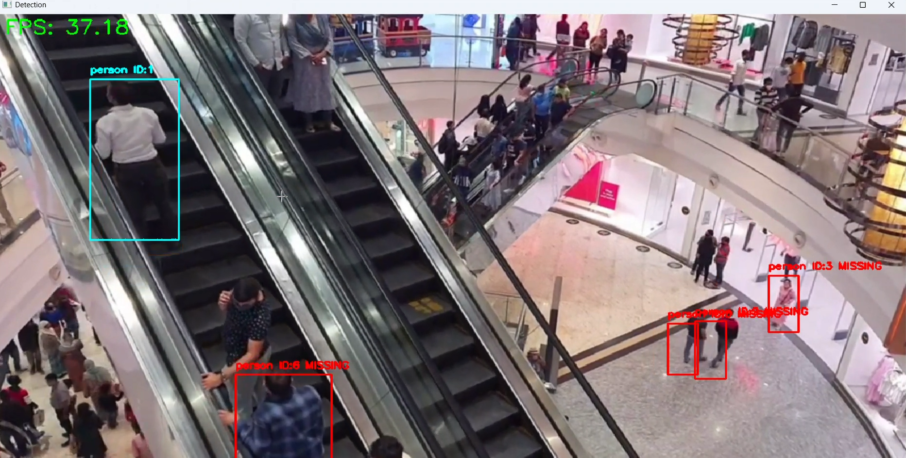

# Real-Time Object Detection and Tracking

A high-performance system for real-time object detection and tracking using YOLOv8 and ByteTrack algorithm implementation.

## Features

- Real-time object detection using YOLOv8 models
- Object tracking with a ByteTrack-inspired algorithm
- Support for webcam and video file inputs
- Performance optimizations for high FPS processing
- Track visualization with different states (new, tracked, lost)
- Video output with annotations
- Customizable processing resolution and detection thresholds
- Optional frame skipping for performance improvement

## Demo Video

Check out the tracking system in action:

[](https://github.com/vishal-singh22/object-detection/blob/4584e41ff1463e9a654ff609f15f9b1331ef774d/output/people-detection.mp4)


> Click the image above to download/play the full demo video.

## System Requirements

### Hardware

The system was developed and tested on the following hardware configuration:
- **CPU**: Intel Core i5 11th Generation
- **RAM**: 8GB
- **GPU**: NVIDIA GeForce GTX 1650 (4GB VRAM)

### Software

- Python 3.8+
- PyTorch with CUDA 11.6
- OpenCV (cv2)
- Ultralytics YOLOv8
- NumPy

With this hardware configuration, the system achieves 30+ FPS on YOLOv8n model at 640x480 resolution.

## Installation

```bash
# Clone the repository
git clone https://github.com/vishal-singh22/object-detection.git
cd object-detection

# Create and activate a virtual environment (optional but recommended)
python -m venv venv
source venv/bin/activate  # On Windows: venv\Scripts\activate

# Install dependencies with CUDA 11.6 support
pip install torch torchvision --extra-index-url https://download.pytorch.org/whl/cu116
pip install opencv-python numpy ultralytics
```

## Usage

```bash
python Object-detection.py --source [SOURCE] --model [MODEL_PATH] [OPTIONS]
```

### Arguments

| Argument | Default | Description |
|----------|---------|-------------|
| `--source` | `0` | Source for video (0 for webcam, or path to video file) |
| `--model` | `yolov8n.pt` | Path to YOLO model |
| `--conf` | `0.5` | Confidence threshold for detections |
| `--device` | `cuda` | Device to run inference on (`cuda`, `cpu`) |
| `--resolution` | `640x480` | Input resolution (WxH) |
| `--process-resolution` | `384x384` | Processing resolution (WxH) |
| `--frame-skip` | `0` | Number of frames to skip (0=no skip, 1=every other frame, etc.) |
| `--save-video` | `False` | Save output video |
| `--output-dir` | `output` | Directory to save output video |
| `--display` | `True` | Display real-time detection |

### Examples

```bash
# Run with webcam
python Object-detection.py --device cuda

# Run with video file
python Object-detection.py --source path/to/video.mp4 --save-video

# Run with custom model and higher confidence threshold
python Object-detection.py --model yolov8m.pt --conf 0.6

# Run on CPU with reduced resolution for better performance
python Object-detection.py --device cpu --process-resolution 320x320
```

## How It Works

### ByteTracker Implementation

The code includes a simplified ByteTrack algorithm implementation that:

1. Matches detections to existing tracks using IoU (Intersection over Union)
2. Updates track states (new, tracked, lost, removed)
3. Manages track histories for visualization

### Performance Optimization

The implementation includes several optimizations:

- TensorRT acceleration when available
- Half-precision (FP16) for CUDA devices
- Asynchronous video writing
- Frame skipping option
- Resolution control for processing
- CUDA 11.6 for GPU acceleration

### Output

The system displays:
- Bounding boxes with track IDs
- Object class labels
- Track states (new, tracked, lost)
- Real-time FPS counter

## Performance Statistics

At the end of execution, the system reports:
- Average FPS
- Minimum FPS
- Maximum FPS
- Total processed frames
- Whether target FPS (35+) was achieved

### Performance on Test Hardware

On our test configuration (Intel Core i5 11th Gen, 8GB RAM, GTX 1650 4GB), we achieved:
- ~40-45 FPS with YOLOv8n model at 384x384 processing resolution
- ~30-35 FPS with YOLOv8s model at 384x384 processing resolution
- TensorRT acceleration provided an additional 15-20% performance boost

## Customization

### Model Selection

You can use any YOLOv8 model variant:
- yolov8n.pt (nano - fastest, less precise) 
- yolov8s.pt (small)
- yolov8m.pt (medium)
- yolov8l.pt (large)
- yolov8x.pt (xlarge - slowest, most precise)

### Tracker Parameters

Modify the ByteTracker initialization parameters for different tracking behaviors:
- `max_age`: How many frames a lost track is kept before removal
- `min_hits`: Minimum detections before a track is confirmed
- `iou_threshold`: IoU threshold for matching detections to tracks

## License

[MIT License](LICENSE)

## Acknowledgements

- [Ultralytics YOLOv8](https://github.com/ultralytics/ultralytics)
- [ByteTrack Paper](https://arxiv.org/abs/2110.06864)
- NVIDIA for CUDA 11.6 support
